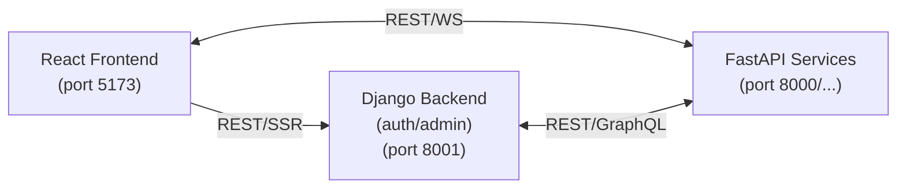

# Project Matrice

## Application web professionnelle

Basée sur :

* React (frontend)
* Django (core back‑office/auth)
* FastAPI (services critiques)

L’objectif est d’avoir une UI moderne et réactive, une base back‑office robuste (auth, admin, RBAC) et des services performants pour les besoins critiques.

Pour le dev, possibilité de démarrer 100% en local ou 100% en Docker. Dans les 2 cas, les hotreload + rafraichissement du navigateur (grâce à WS).

## Processes Démarrage

### Local

```css
./start
```

Attention: La 1ère fois :

```css
./setup
```

À l'issue :

* [API](http://localhost:8000/docs)
* [BE](http://localhost:8001/admin) → Login: admin / admin
* [FE](http://localhost:5173)

**Note :** Un seul environnement virtuel à la racine (`.venv/`) contient toutes les dépendances Python (FastAPI + Django).

OU, 'à la main' :

1) BE - FastAPI

   * Créer un venv : python -m venv .venv
   * Activer : .venv\Scripts\activate
   * Installer :
     * python -m pip install --upgrade pip
     * pip install -r backend/requirements.txt
   * Lancer : uvicorn backend.app.main:app --reload --host 0.0.0.0 --port 8000

2) BE - Django

    Autre CLI :
    * Installer : pip install -r backend/django/requirements.txt
    * Migrations : python backend/django/manage.py migrate
    * Créer admin : python backend/django/manage.py shell -c "from django.contrib.auth import get_user_model; User = get_user_model(); User.objects.filter(username='admin').exists() or User.objects.create_superuser('admin', 'admin@localhost', 'admin')"
    * Lancer : python backend/django/manage.py runserver 0.0.0.0:8001

3) FE - React

    Autre CLI :
    cd frontend
    * Si 1ère fois
      Installer : npm i (dans frontend)
    * Lancer : npm run dev

### Docker

#### Lancer Docker-desktop + Containers

Note: Avoir fait fontionné l'App en mode local au préalable

Dans racine (Dev):

docker compose -f docker-compose.dev.yml up --build -d

OU (Prod):

docker compose -f docker-compose.prod.yml up --build -d

---

## Architecture

<!--
┌─────────────────┐         REST/WS          ┌──────────────────┐
│  React Frontend │◄────────────────────────►│ FastAPI Services │
│  (port 5173)    │                          │ (port 8000/...)  │
└─────────────────┘                          └──────────────────┘
     │                                                 ▲
     │ REST/SSR                                        │
     ▼                                                 │
┌─────────────────┐            REST/GraphQL            │
│ Django Backend  │◄───────────────────────────────────┘
│ (auth/admin)    │
│ (port 8001)     │
└─────────────────┘
-->



FastAPI (services critiques) :

```php
backend/
├── app/
│   ├── __init__.py
│   ├── main.py
│   ├── config.py          # Configuration centralisée
│   ├── routers/           # Routes organisées
│   │   ├── __init__.py
│   │   ├── api.py
│   │   └── websocket.py
│   ├── services/          # Logique métier
│   │   └── __init__.py
│   ├── models/            # Modèles Pydantic
│   │   └── __init__.py
│   └── middleware/        # CORS, auth, etc.
│       └── __init__.py
```

Django (core back‑office/auth) :

```php
backend/
├── app/
│   ├── ...
├── django/
│   ├── manage.py
│   ├── config/                # settings, urls, wsgi/asgi
│   │   ├── __init__.py
│   │   ├── settings.py
│   │   ├── urls.py
│   │   ├── wsgi.py
│   │   └── asgi.py
│   ├── apps/
│   │   ├── users/             # users, roles, permissions
│   │   ├── auth/              # auth/jwt/SSO
│   │   └── adminpanel/        # back-office
│   └── requirements.txt
```

React (frontend) :

```php
frontend
├── public/                   # Assets statiques
├── src/
│   ├── main.jsx              # Point d'entrée
│   ├── App.jsx               # Composant racine
│   ├── index.css             # Styles globaux
│   ├── assets/               # Images, fonts
│   └── context/              # Context API
│       └── BackendContext.jsx
├── index.html
├── package.json
├── vite.config.js
├── tailwind.config.js
├── eslint.config.js
├── Dockerfile
└── Dockerfile.prod
```

---

## Configuration (.env)

**⚠️ IMPORTANT : Sécurité implémentée !**

Les fichiers `.env` sont maintenant requis pour configurer l'application de manière sécurisée.

### Première installation

```bash
# Windows
setup.bat

# Ou manuellement
cp .env.example .env
# Éditer .env avec vos valeurs
```

### Variables essentielles

```bash
# Environnement
ENV=dev                          # dev, staging, prod

# FastAPI
FASTAPI_PORT=8000
FASTAPI_CORS_ORIGINS=http://localhost:5173,http://localhost:3000

# Django
DJANGO_SECRET_KEY=votre-cle-secrete-50-caracteres-minimum
DJANGO_DEBUG=True                # False en production !
DJANGO_ALLOWED_HOSTS=localhost,127.0.0.1
DJANGO_CORS_ORIGINS=http://localhost:5173,http://localhost:3000

# Frontend
VITE_BACKEND_URL=http://localhost:8000
VITE_DJANGO_URL=http://localhost:8001
```

### Générer une SECRET_KEY sécurisée

```bash
python -c "from django.core.management.utils import get_random_secret_key; print(get_random_secret_key())"
```

**📖 Consultez [SECURITY.md](z_doc/SECURITY.md) pour le guide complet de sécurité**

---

## Roadmap priorisée

P0 (bloquant)

* ✅ **Sécurité & configuration (.env, CORS, secrets)**
  *  Fichiers .env pour tous les services
  * CORS configuré (FastAPI + Django)
  * Secrets externalisés
  * Configuration par environnement
  * Voir [SECURITY.md](z_doc/SECURITY.md)

* ❌ Auth JWT + RBAC
* ❌ Reverse proxy + routing

P1 (pro)
* ❌ Tests (pytest, Vitest, Playwright)
* ❌ CI/CD (lint, tests, build, push image)
* ❌ Logging structuré + metrics

P2 (scale)
* ❌ Cache/DB (PostgreSQL/Redis)
* ❌ Observabilité (traces, dashboards)
* ❌ Versioning API + doc enrichie

---

## Notes

* Le frontend appelle les APIs via le proxy.
* Le backend ne sert pas le frontend directement.
* Les responsabilités sont découplées pour scaler proprement.
* APIs rapides et scalables

---

Dans une version de Battle Plan (BP) précédente, on avait cela comme targets...
Vérifier chaque point et qu'elles sont atteintes (sous autre forme peut-être) dans l'actuelle Roadmap

🎯 Améliorations Prioritaires :

1. //2do Sécurité & Configuration

    CORS correctement configuré, mais aActuellement manquant dans FastAPI :
    * Rate limiting
    * Protéger vos endpoints contre les abus.

2. //2do Structure Backend Modulaire

    État actuel : Tout dans main.py
    Problème : Difficile à maintenir quand le projet grandit
    * Structure à revoir

3. //2do Gestion d'Erreurs Frontend

    Problèmes actuels :
    * Pas de gestion d'erreur pour les fetch
    * Pas de retry automatique
    * Pas de feedback utilisateur en cas d'échec

4. //2do Tests Automatisés

    Actuellement manquants, ce qui rend les modifications risquées. À ajouter :
    * Tests unitaires backend (pytest)
    * Tests unitaires frontend (Vitest)
    Tests E2E (Playwright)
    * ///2fix **URGENT** → Tester le bon fonctionnement du hotrefresh (Sur les 3 serveurs), compris le refraichissement effectué du browser, et lancer ces tests au start.bat → BIG message si pb

5. //2do Base de Données

    Ajouter PostgreSQL pour :
    * Persister les données
    * Gérer les sessions utilisateurs
    * Cache

6. //2do Monitoring & Logging
    Actuellement : Aucun logging structuré
    À ajouter :
    * Logging avec niveaux (INFO, ERROR, DEBUG)
    * Monitoring des WebSockets actifs
    * Métriques de performance

7. //2do CI/CD

    GitHub Actions pour :

    * Linter le code automatiquement
    * Exécuter les tests
    * Builder les images Docker
    * Déployer automatiquement

8. //2do Documentation API

    FastAPI génère automatiquement une doc, mais :
    * Ajouter des descriptions détaillées aux endpoints
    Créer des exemples d'utilisation
    * Documenter les schémas WebSocket

9. //2do Performance Frontend

    Optimisations possibles :
    * Code splitting (lazy loading des composants)
    * Mise en cache des requêtes
    * Debounce sur les événements fréquents
  Service Worker pour le mode offline

10. //2do Authentification & Autorisation

    Actuellement : Aucune sécurité (En cours)

//2do À ajouter :

* JWT tokens (En cours)
* Sessions utilisateurs
* Rôles et permissions
* OAuth2 (Google, GitHub)
* CF. [Contrôle de Sécu](https://github.com/protectai/vulnhuntr)
