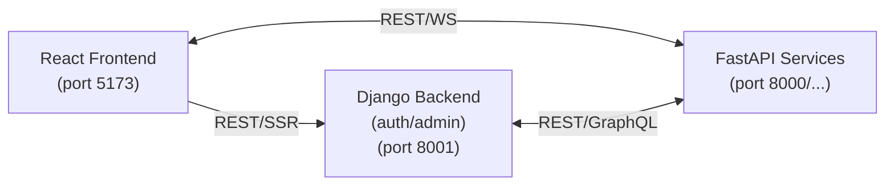

# Project Matrice


## Application web professionnelle

Basée sur :

* React (frontend)
* Django (core back‑office/auth)
* FastAPI (services critiques)

L’objectif est d’avoir une UI moderne et réactive, une base back‑office robuste (auth, admin, RBAC) et des services performants pour les besoins critiques.

Pour le dev, possibilité de démarrer 100% en local ou 100% en Docker. Dans les 2 cas, les hotreload + rafraichissement du navigateur (grâce à WS).

## Processes Démarrage

### Local

```css
./start.bat
```

//2do récupé .bat de fastAPI (+ complet) et adapté dedans démarrage de Django en vérifiant que celui-ci bénéficie aussi du complet hotreload

OU

1) BE - FastAPI

   * Créer un venv : python -m venv .venv
   * Activer : .venv\Scripts\activate
   * Installer : pip install -r backend/requirements.txt
   * Lancer : uvicorn backend.app.main:app --reload --host 0.0.0.0 --port 8000

2) BE - Django

   * Installer : pip install -r backend/django/requirements.txt
   * Migrations : python backend/django/manage.py migrate
   * Lancer : python backend/django/manage.py runserver 0.0.0.0:8001

3) FE - React

    Autre CLI :
    cd frontend
   * Si 1ère fois
     Installer : npm i (dans frontend)
   * Lancer : npm run dev

### Docker

#### Lancer Docker-desktop + Containers

Dans racine (Dev):

docker compose -f docker-compose.dev.yml up --build -d

OU (Prod):

docker compose -f docker-compose.prod.yml up --build -d

#### 1ère fois: Créer Ctnrs Docker

* Supprimer l'ancienne image
docker rmi fastapi_img:v0

* Rebuild avec la nouvelle version
<!-- docker build -t fastapi_backend:v0 . -->

docker compose up --build

On doit voir les fichiers dans le Cntnr
docker exec -it fastapi_backend_dev ls -l /app

* Test

api-app :
docker run -p 8000:8000 fastapi_img:v0
todo-app :
docker run -p 8000:8080 fastapi_img:v0
(port_local:port_docker)

---

## Architecture cible

<!--
┌─────────────────┐         REST/WS          ┌──────────────────┐
│  React Frontend │◄────────────────────────►│ FastAPI Services │
│  (port 5173)    │                          │ (port 8000/...)  │
└─────────────────┘                          └──────────────────┘
     │                                                 ▲
     │ REST/SSR                                        │
     ▼                                                 │
┌─────────────────┐            REST/GraphQL            │
│ Django Backend  │◄───────────────────────────────────┘
│ (auth/admin)    │
│ (port 8001)     │
└─────────────────┘
-->



FastAPI (services critiques) :

<!--
backend/
├── app/
│   ├── __init__.py
│   ├── main.py
│   ├── config.py          # Configuration centralisée
│   ├── routers/           # Routes organisées
│   │   ├── __init__.py
│   │   ├── api.py
│   │   └── websocket.py
│   ├── services/          # Logique métier
│   │   └── __init__.py
│   ├── models/            # Modèles Pydantic
│   │   └── __init__.py
│   └── middleware/        # CORS, auth, etc.
│       └── __init__.py
-->

backend/
├── app/
│   ├── __init__.py
│   ├── main.py
│   ├── config.py          # Configuration centralisée
│   ├── routers/           # Routes organisées
│   │   ├── __init__.py
│   │   ├── api.py
│   │   └── websocket.py
│   ├── services/          # Logique métier
│   │   └── __init__.py
│   ├── models/            # Modèles Pydantic
│   │   └── __init__.py
│   └── middleware/        # CORS, auth, etc.
│       └── __init__.py

Django (core back‑office/auth) :

<!--
backend/
├── app/
│   ├── ...
├── django/
│   ├── manage.py
│   ├── config/                # settings, urls, wsgi/asgi
│   │   ├── __init__.py
│   │   ├── settings.py
│   │   ├── urls.py
│   │   ├── wsgi.py
│   │   └── asgi.py
│   ├── apps/
│   │   ├── users/             # users, roles, permissions
│   │   ├── auth/              # auth/jwt/SSO
│   │   └── adminpanel/        # back-office
│   └── requirements.txt
-->

backend/
├── app/
│   ├── ...
├── django/
│   ├── manage.py
│   ├── config/                # settings, urls, wsgi/asgi
│   │   ├── __init__.py
│   │   ├── settings.py
│   │   ├── urls.py
│   │   ├── wsgi.py
│   │   └── asgi.py
│   ├── apps/
│   │   ├── users/             # users, roles, permissions
│   │   ├── auth/              # auth/jwt/SSO
│   │   └── adminpanel/        # back-office
│   └── requirements.txt
---

## Configuration (.env)

Variables minimales (exemple) :

```bash
ENV=dev
API_URL=http://api:8000
DJANGO_URL=http://core:8001
```

---

## Roadmap priorisée

P0 (bloquant)

- Sécurité & configuration (.env, CORS, secrets)
- Auth JWT + RBAC
- Reverse proxy + routing

P1 (pro)
- Tests (pytest, Vitest, Playwright)
- CI/CD (lint, tests, build, push image)
- Logging structuré + metrics

P2 (scale)
- Cache/DB (PostgreSQL/Redis)
- Observabilité (traces, dashboards)
- Versioning API + doc enrichie

---

## Notes

- Le frontend appelle les APIs via le proxy.
- Le backend ne sert pas le frontend directement.
- Les responsabilités sont découplées pour scaler proprement.
→ APIs rapides et scalables

----

Dans une version de Battle Plan (BP) précédente, on avait cela comme targets...
Vérifier qu'elle sont atteintes (sous autre forme peut-être) dans l'actuelle BP
🎯 Améliorations Prioritaires
1. //2do Sécurité & Configuration
    Variables d'environnement (.env)
    Créer des fichiers .env pour gérer les configurations :
    Avantages :
    Pas de secrets en dur dans le code
    Configuration différente par environnement
    Plus facile à déployer
    CORS correctement configuré
    Actuellement manquant dans FastAPI, ce qui peut causer des problèmes en production.
    Rate limiting
    Protéger vos endpoints contre les abus.
2. //2do Structure Backend Modulaire XXX
    État actuel : Tout dans main.py
    Problème : Difficile à maintenir quand le projet grandit
    Structure recommandée :
3. //2do Gestion d'Erreurs Frontend
    Problèmes actuels :
    Pas de gestion d'erreur pour les fetch
    Pas de retry automatique
  Pas de feedback utilisateur en cas d'échec
4. //2do Tests Automatisés
    Actuellement manquants, ce qui rend les modifications risquées.
    À ajouter :
    Tests unitaires backend (pytest)
    Tests unitaires frontend (Vitest)
    Tests E2E (Playwright)
5. //2do Base de Données
    Ajouter PostgreSQL ou Redis pour :
    Persister les données
    Gérer les sessions utilisateurs
    Cache
6. //2do Monitoring & Logging
    Actuellement : Aucun logging structuré
    À ajouter :
    Logging avec niveaux (INFO, ERROR, DEBUG)
    Monitoring des WebSockets actifs
    Métriques de performance
7. //2do CI/CD
    GitHub Actions pour :
    Linter le code automatiquement
    Exécuter les tests
    Builder les images Docker
    Déployer automatiquement
8. //2do Documentation API
    FastAPI génère automatiquement une doc, mais vous pourriez :
    Ajouter des descriptions détaillées aux endpoints
    Créer des exemples d'utilisation
    Documenter les schémas WebSocket
9. //2do Performance Frontend
    Optimisations possibles :
    Code splitting (lazy loading des composants)
    Mise en cache des requêtes
    Debounce sur les événements fréquents
  Service Worker pour le mode offline
10. //2do Authentification & Autorisation
    Actuellement : Aucune sécurité
//2do À ajouter :
JWT tokens
Sessions utilisateurs
Rôles et permissions
OAuth2 (Google, GitHub)
