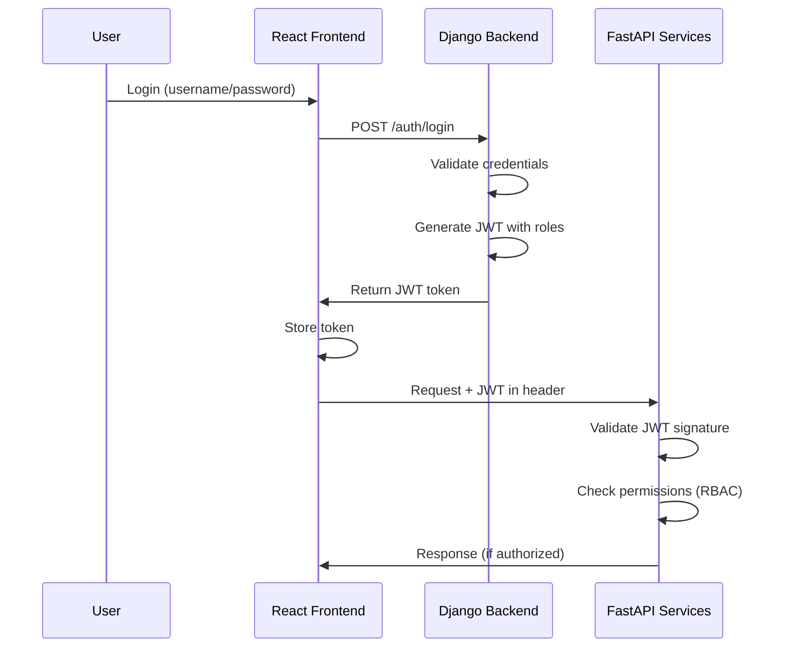

# Authentification JWT + RBAC

## Définitions des acronymes

### JWT

**JSON Web Token** est un standard ouvert (RFC 7519) qui définit une manière compacte et autonome de transmettre de façon sécurisée des informations entre deux parties sous forme d'objet JSON. Ces informations peuvent être vérifiées et fiables car elles sont signées numériquement.

### RBAC

**Role-Based Access Control** (Contrôle d'accès basé sur les rôles) est une approche de gestion des permissions où les droits d'accès sont attribués aux utilisateurs en fonction de leurs rôles dans l'organisation, plutôt qu'individuellement à chaque utilisateur.

---

## Introduction

JWT et RBAC sont **deux concepts complémentaires mais indépendants** qui peuvent être utilisés ensemble ou séparément selon les besoins de votre application.

---

## JWT seul (Authentification)

Vous pouvez avoir JWT **sans** RBAC :

- JWT identifie **qui** est l'utilisateur
- Tous les utilisateurs authentifiés ont les mêmes droits
- Utile pour des apps simples où tout le monde peut tout faire

**Exemple** : Blog personnel où seul le propriétaire se connecte

---

## RBAC seul (Autorisation)

Vous pouvez avoir RBAC **sans** JWT :

- Utiliser des sessions traditionnelles (cookies)
- Ou d'autres mécanismes d'auth (OAuth, SAML)
- RBAC gère juste **ce que** l'utilisateur peut faire

**Exemple** : App avec sessions Django classiques + rôles

---

## JWT + RBAC ensemble (Recommandé)

Dans une architecture moderne (comme la vôtre), les combiner apporte :

### JWT → "Qui es-tu ?" (Authentification)

- Token stateless
- Scalable pour microservices
- FastAPI peut valider sans appeler Django

### RBAC → "Que peux-tu faire ?" (Autorisation)

- Rôles encodés **dans le JWT**
- Permissions vérifiées à chaque requête
- Contrôle granulaire

### Exemple de JWT avec RBAC

```json
{
  "user_id": 123,
  "username": "alice",
  "role": "manager",
  "permissions": ["read", "update"],
  "exp": 1737500000
}
```

---

## Pour votre projet

Vu votre architecture (React + FastAPI + Django), **JWT + RBAC** est le plus adapté :

1. **Django** génère les JWT avec les rôles
2. **FastAPI** valide les JWT et vérifie les permissions
3. **React** adapte l'UI selon le rôle

### Flux d'authentification recommandé



### Avantages pour votre architecture

- ✅ **Stateless** : Pas de sessions à partager entre services
- ✅ **Scalable** : Chaque service valide le token indépendamment
- ✅ **Sécurisé** : Signature cryptographique du token
- ✅ **Flexible** : Granularité fine des permissions
- ✅ **Moderne** : Standard de l'industrie pour les microservices

---

## Implémentation progressive

Vous pouvez commencer par **JWT simple**, puis ajouter **RBAC** plus tard si nécessaire :

### Phase 1 : JWT basique

- Authentification utilisateur
- Token avec ID utilisateur uniquement
- Tous les utilisateurs authentifiés = mêmes droits

### Phase 2 : Ajout RBAC

- Rôles (Admin, Manager, User)
- Permissions encodées dans le JWT
- Contrôles d'accès dans FastAPI et Django

### Phase 3 : RBAC avancé

- Permissions granulaires par ressource
- Rôles dynamiques configurables
- Audit des accès
